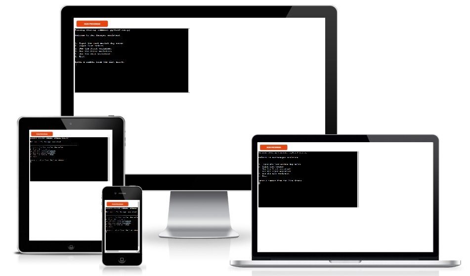
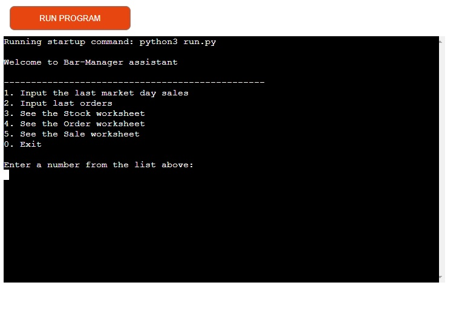
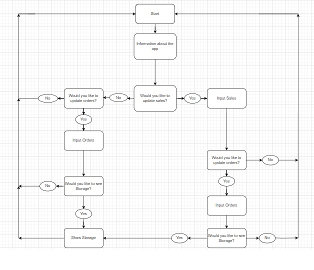
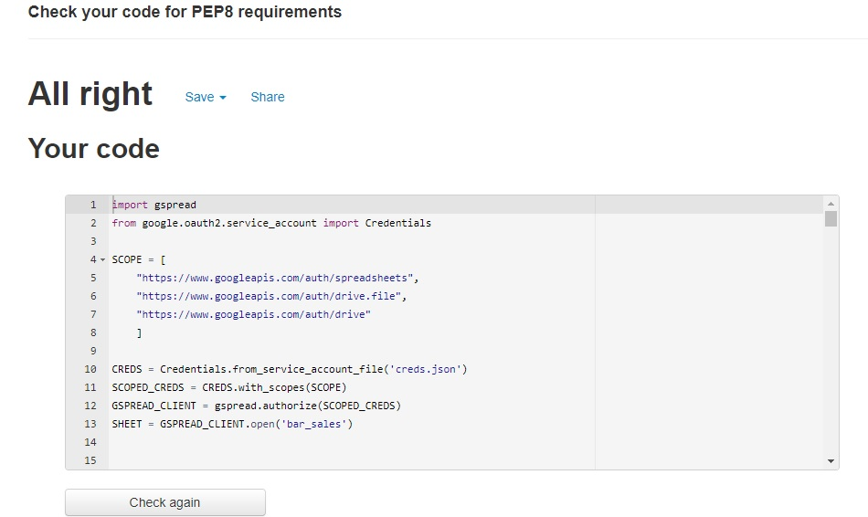

# Bar-Manager assistant

[This link takes you to my project.](https://bar-manager-assistant.herokuapp.com/)

This project is meant to be a helpful tool for Bars or Restaurants managers. It gives the possibility to keep records very easily in a spreadsheet. It is also very helpful for the inventory process and to fight a disturbing phenomenon as 'off record sales'.

  

## My Goals For This Project:

* To easily record evrything that goes in or out in a business.
* To automate some calculations regarding inventory. 
* To have a quick view of these records.
* To ensure navigation is simple and consistent throughout.
* To ensure the program runs smoothly with no issues.
* To give the user an overall easy and pleasant experience.

## How To Use It (UX)

As the program starts the user is presented with a welcome message, a list of options (menu) to choose from, and of course a brief instruction.
The user simply has to enter relevant numbers and press enter. After each option is used, the user can choose again from the menu.  
If the user chooses to exit the program, a goodbye message is printed and the program ends.
 

## Features

### Existing features

* Accepts user inputs.
* Validates user inputs depending on the specific requirements of each input. For example, the menu requires the user to input a number from 0-5, the input sales choice requires the user to input exactly 8 numbers separated by commas. If the input is not valid an appropriate error message is printed and the user is asked to try again.
* Pulls data from the worksheets and does calculations.
* Updates relevant worksheets after inputs.

### Future features

* I would like to add more pub sales articles, which need more complicated calculations.
* I would like to add also order recommendations based on monthly sales as well as on different seasons of the year.

## Planning

To plan this project I created a flow chart to help visualise the process of the project. It was also very helpful for seeing what functions I would need and where to implement them. But as coding along, I found out that this aproach would be very confusing for the user. The user doesn't have to go through all options every time, so i decided that a menu would fit perfectly(learning by doing type).

## Testing

I have manually tested this project by:
* Giving invalid inputs e.g. strings when only a number is required, numbers outside of the allowed range.
* Testing in my local terminal and the Code Institute Heroku terminal.
* Passing the code through a PEP8 linter and confirming there are no problems.

### Validator tesing

PEP8:
* Ran through pep8online.com with no issues

## Bugs

### Solved Bugs

* My menu validation function failed to work and caused the program to exit as I had put the break statement in the wrong place.

* I had issues updating the row in the stock worksheet. It kept throwing me errors using the update method. After searching online I figured out what caused my problem, but as the data was pulled automatically from other worksheets, I couldn't fix that. As I should find a way to update this worksheet (it's important for such a program), I used at first delete_rows method and then append_row, which works fine.

### Remaining Bugs

There are no remaining Bugs in my project, but I am not really satisfied with how the worksheets are displayed in the terminal. Maybe I had to import other libraries to fix it, but I kept it simple.

## Deployment

This project was deployed using Code Institue's mock terminal for Heroku.
The steps for deployment are as follows:
* Sign up to Heroku
* Create a new Heroku app, give it an appropriate name (bar-manager-assistant)
* In settings, add two config vars, one with Key and Value of PORT and 8000, respectively. The other with the Key CREDS and Value of the contents of my creds.json file
* Whilst in settings, set the buildbacks to Python and NodeJS in that order
* Connect the Heroku app to the GitHub repository
* Click Deploy

## Credits

* I was inspired by the Code Institute Love Sandwiches Walkthrough Project and I wanted to take this program a step further and maybe later will be a real app. Therefore some code blocks are copied from the Love Sandwiches project and adapted for this project.

## Acknowledgements
-   My Mentor for continuous helpful feedback.
-   Tutor support at Code Institute for their support.